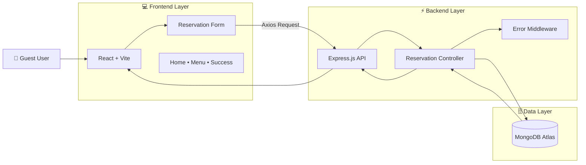
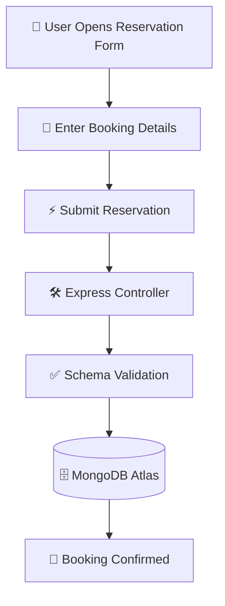

# 🏨 Hotel Reservation Management System

> A modern full-stack Hotel & Restaurant Reservation Management Platform built with React, Vite, Express.js, and MongoDB Atlas.

The platform streamlines hotel room and restaurant table reservations through a fast, validation-driven workflow while providing administrators with reliable reservation tracking and management capabilities.

---

## 🚀 Live Demo

| Resource           | Status      |
| ------------------ | ----------- |
| 🌐 Frontend Portal | Coming Soon |
| ⚡ Backend API      | Active      |
| 🗄️ MongoDB Atlas  | Connected   |

---

## 📌 Problem Statement

Traditional reservation systems often suffer from:

* Double bookings
* Poor validation mechanisms
* Slow response times
* Unstructured reservation tracking
* Difficult customer management

The **Hotel Reservation Management System** solves these challenges through a highly responsive React frontend and a robust Express + MongoDB backend architecture that ensures secure and efficient reservation handling.

---

## ✨ Key Features

### 👤 Guest Features

* Hotel Room Reservation
* Restaurant Table Booking
* Interactive Reservation Forms
* Booking Confirmation System
* Mobile Responsive Experience
* Fast Form Validation
* Success & Confirmation Pages

### 🏨 Management Features

* Reservation Tracking
* Customer Information Storage
* Reservation History Management
* Real-Time Database Synchronization
* Validation-Driven Reservation Processing

### 🔒 Security Features

* Schema-Level Validation
* Secure API Communication
* Centralized Error Handling
* Environment Variable Protection
* MongoDB Data Integrity

---

## 🏗️ Tech Stack

### Frontend

* React 19
* Vite
* React Router
* Axios
* CSS3
* Responsive Design

### Backend

* Node.js
* Express.js
* Mongoose ODM

### Database

* MongoDB Atlas

### Deployment

* Vercel
* MongoDB Atlas Cloud

---

## 🏛️ System Architecture



---

## ⚙️ Reservation Workflow



---

## 📂 Project Structure

```text
HOTEL_RESERVATION_MANAGMENT/

├── backend/
│   ├── controller/
│   ├── database/
│   ├── middlewares/
│   ├── models/
│   ├── routes/
│   ├── app.js
│   ├── config.env
│   └── server.js
│
└── frontend/
    ├── src/
    │   ├── components/
    │   ├── Pages/
    │   ├── App.jsx
    │   ├── App.css
    │   └── main.jsx
    │
    ├── index.html
    └── vite.config.js
```

---

## 🔐 Reservation Validation Rules

### Customer Details

* First Name: 3–30 characters
* Last Name: 3–30 characters
* Email: Valid email format
* Phone Number: 11 digits
* Date & Time: Required

### Database Validation

All reservations pass through Mongoose schema validation before being stored in MongoDB.

---

## ⚙️ Installation

### Clone Repository

```bash
git clone https://github.com/viveks-002/HOTEL_RESERVATION_MANAGMENT.git
```

### Setup Backend

```bash
cd backend

npm install

npm start
```

### Setup Frontend

```bash
cd frontend

npm install

npm run dev
```

---

## 🔑 Environment Variables

### Backend (`backend/config.env`)

```env
PORT=5000
MONGO_URI=your_mongodb_atlas_connection_string
FRONTEND_URL=http://localhost:5173
```

### Frontend (`frontend/.env`)

```env
VITE_BAKEND_URL=http://localhost:5000
```

---

## 📸 Screenshots

### 🏨 Reservation Page

Add Screenshot Here

### 🍽️ Menu Section

Add Screenshot Here

### ✅ Booking Success Page

Add Screenshot Here

---

## 🎯 Future Enhancements

* 💳 Stripe Payment Gateway
* 📧 Email Confirmation System
* 📄 PDF Booking Receipts
* 🕒 Dynamic Reservation Calendar
* 📊 Admin Dashboard
* 🔔 Real-Time Notifications
* ⭐ Reviews & Ratings
* 📱 Progressive Web App (PWA)

---

## 📈 Learning Outcomes

This project helped in gaining hands-on experience with:

* Full Stack Web Development
* REST API Design
* MongoDB Database Management
* Express Middleware Architecture
* Form Validation
* Error Handling
* Cloud Deployment
* Responsive UI Development

---

## 👨‍💻 Author

### Vivek Singh

* GitHub: https://github.com/viveks-002
* Codeforces: https://codeforces.com/profile/Vive_02

---

## ⭐ Support

If you found this project useful, consider giving it a **Star ⭐** on GitHub.

---

### Made with ❤️ using React, Express.js, MongoDB & Vite
